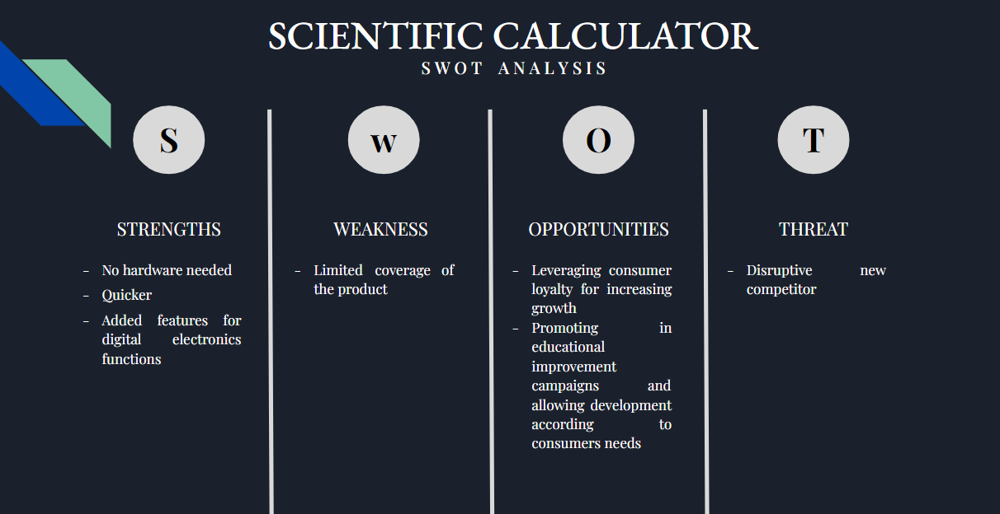

# **Requirements**
## **Introduction**
A Calculator is a small (often pocket-sized), usually inexpensive electronic device used to perform the basic operations of arithmetic. This project presents the development of a software-based scientific calculator using Visual Studio Code which includes various operations from as basic as arithmetic operations to as advanced as truth tables for logic gates. The software can be used by anybody in order to calculate easily, effectively and accurately.

## **Cost and Features**
- ### **Cost:**
  * Given that the project is well built and all requirements are met, the cost may vary depending on the market.
- ### **Features:**
  * This scientific calulators perform basic operations along with trigonometric operations and digital electronics functions.
  * Using C language, the model is solved in quick time.

## **SWOT Analysis**

## **4W's and 1H**
- ### **Who:**
  This user friendly software-based utility can be used by all from students' community to industries.
- ### **What:**
  This user friendly software-based utility is used to do the suitable calculations for various applications.
- ### **When:**
  Can be used in situations that require quick access to certain mathematical functions, especially those that were once looked up in mathematical tables, such as trigonometric functions as well as to certain basics of digital electronics.
- ### **Where:**
  It can be used for advanced math calculations or in an industry that regularly uses complicated calculations to design or develop advanced concepts like engineering.
- ### **How:**
  The user opts for their desired choice of operation they wish to perform, feeds in the inputs and gets the result instantaneously.

## **High Level Requirements**
|  ID  | Description                                            |   Status    |
| :--: | :----------------------------------------------------- | :---------: |
| HR01 | Arithmetic Operations for two or more numbers          | Implemented |
| HR02 | Power, square root and factorial                       | Implemented |
| HR03 | Trigonometric fucntions                                | Implemented |
| HR04 | Basics formaulations and logics of digital electronics | Implemented |
| HR05 | Implementation using C Language                        | Implemented |
| HR06 | Should be user-friendly                                | Implemented |

## **Low Level Requirements**
|  ID  | Description                                                                                                              | HRID |   Status    |
| :--: | :----------------------------------------------------------------------------------------------------------------------- | :--: | :---------: |
| LR01 | For each set of numbers the arthimetic operations are performed and exact output is retrieved                            | HR05 | Implemented |
| LR02 | The user can perform as many operations as needed untill they require and exit once they are done with the calculations. | HR01 | Implemented |